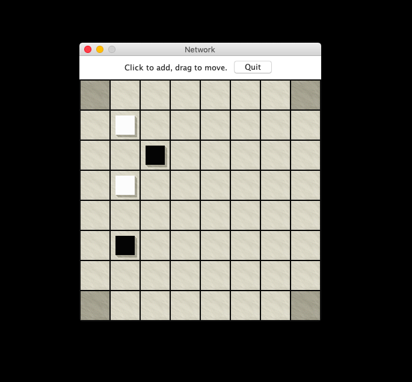

# Network

## Summary

A two player board game with play for Human vs. Computer or Computer vs. Computer enabled. Implemented an AI which can win against the Computer 100% of the time by using minimax (alpha beta pruning) and game trees.

## Description

Network is taken from Sid Sackson, "A Gamut of Games," Dover Publications (New York), 1992.

Each player tries to complete a "network" joining its two goal areas. A network is a sequence of six or more chips that starts in one of the player’s goal areas and terminates in the other.  Each consecutive pair of chips in the sequence are connected to each other along straight lines, either orthogonally (left, right, up, down) or diagonally.

The GUI and code for `Move.java` and `Player.java` provided through the UC Berkeley CS61B class.

## Running Network

You can run Network from the command line in several different configurations.

`java Network machine machine` (Your MachinePlayer competes against itself)

Every combination of "machine", "human", and "random" works.  It’s particularly amusing to pit two random players against each other. If you put a "-q" switch right after the word "Network", Network will quit immediately when the game ends.

`java Network human random`

`java Network human human`

`java Network human machine`

`java Network machine random`
